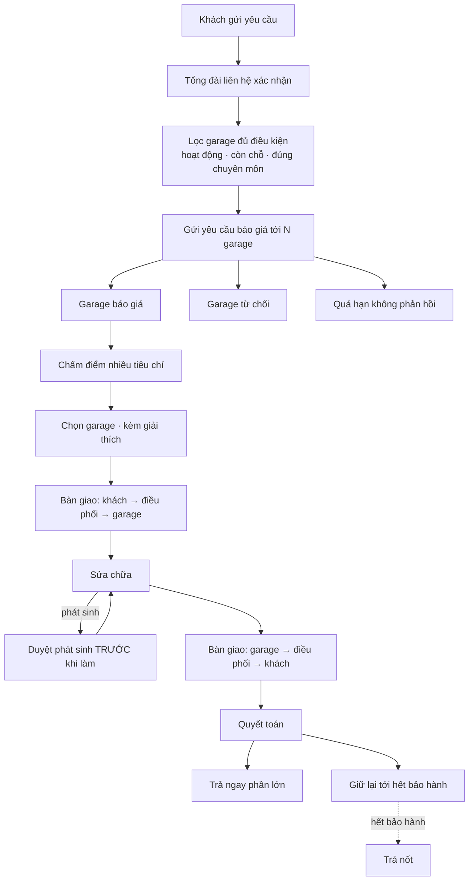
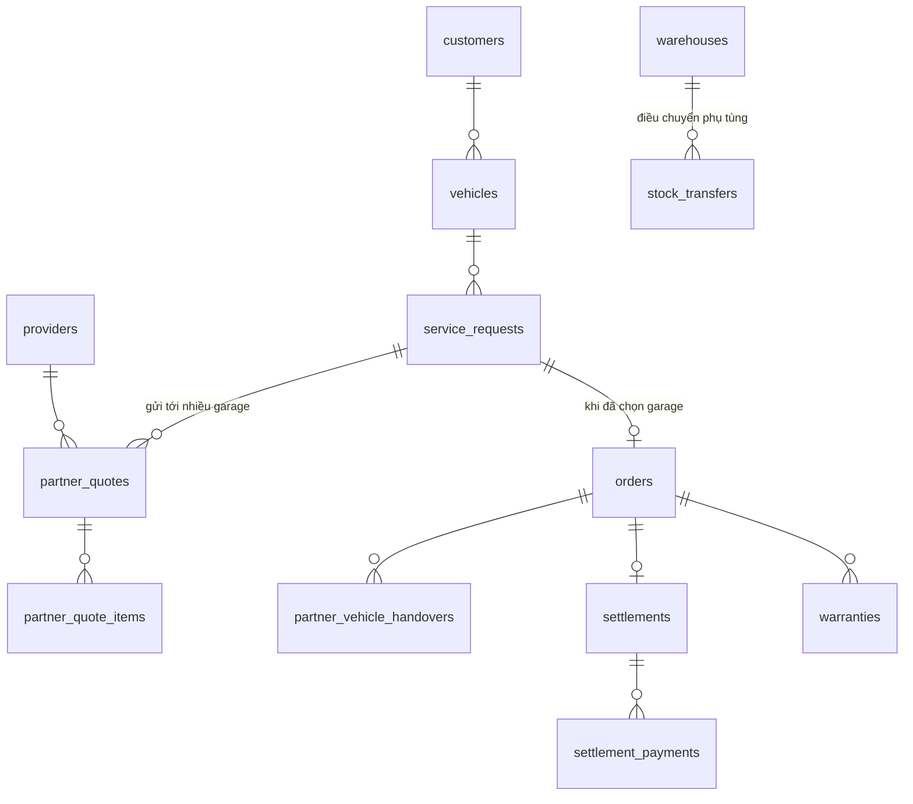

# Kiến trúc

## Vòng đời một ca sửa xe



Repo showcase công khai các hộp **Lọc garage**, **Chấm điểm**, **Chọn garage**, **Bàn giao** và **Quyết toán**.

## Ba bài toán riêng của mô hình mạng lưới

Một garage đơn lẻ không có ba bài toán này, và chúng là toàn bộ lý do hệ thống tồn tại:

| Bài toán | Vì sao khó | Module |
|---|---|---|
| Chọn đối tác cho từng ca | Rẻ nhất thường không phải tốt nhất, nhưng phải giải thích được | `quoting.ts` |
| Bảo đảm chất lượng khi không trực tiếp làm | Không đứng cạnh thợ để nhìn | `settlement.ts` (giữ lại bảo hành) |
| Giữ niềm tin khi xe rời tầm kiểm soát | Tranh chấp không có bằng chứng thì khách chịu thiệt | `handover.ts` |

## Vì sao chấm điểm thay vì để người chọn tay

Người điều phối hoàn toàn có thể tự chọn — họ biết garage nào tốt. Nhưng ba vấn đề xuất hiện khi quy mô tăng:

1. **Không nhất quán.** Hai người điều phối chọn khác nhau cho cùng một tình huống, và garage nhận ra điều đó.
2. **Không giải thích được.** Garage bị loại sẽ hỏi vì sao, và "cảm thấy chỗ kia tốt hơn" không phải câu trả lời giữ được quan hệ đối tác.
3. **Không cải tiến được.** Không có điểm số thì không biết tiêu chí nào đang thực sự dự báo đúng chất lượng.

Chấm điểm không thay thế người — người điều phối vẫn có thể chọn khác. Nhưng khi chọn khác thì họ phải viết lý do, và đó cũng là dữ liệu.

## Điểm chất lượng garage

Điểm chất lượng (0–100) là số tích luỹ từ các lần làm trước: đúng hạn, không phải làm lại, không phát sinh cảnh báo từ chuỗi bàn giao, khách không khiếu nại.

Chi tiết cách tính không nằm trong repo này vì nó gắn chặt với dữ liệu vận hành. Điều đáng nói ở đây là **vòng lặp**: cảnh báo từ `handover.ts` và kết quả từ `settlement.ts` quay lại điều chỉnh điểm chất lượng, và điểm chất lượng quyết định garage đó có được chọn cho ca sau hay không.

```
chọn garage → làm việc → bàn giao (cảnh báo?) → quyết toán (đúng báo giá?)
      ▲                                                      │
      └──────────── điểm chất lượng ◄────────────────────────┘
```

Đây là cơ chế duy nhất mạng lưới có để bảo đảm chất lượng, vì nó không đứng cạnh thợ để nhìn.

## Mô hình dữ liệu



Hai chi tiết:

**`partner_quotes` lưu bản sao thông tin garage** (tên, mã, người liên hệ, số điện thoại) tại thời điểm báo giá, không chỉ tham chiếu `provider_id`. Garage đổi tên hoặc đổi người phụ trách thì báo giá cũ vẫn phải đọc được đúng như lúc phát hành — đây là chứng từ, không phải dữ liệu tra cứu.

**`settlements` cũng lưu bản sao** thông tin thanh toán: mã số thuế, tài khoản ngân hàng, địa chỉ. Cùng lý do, và ở đây còn quan trọng hơn vì đó là chứng từ kế toán.

## Điều chuyển phụ tùng giữa kho

Mạng lưới có kho phụ tùng riêng. Khi một garage cần phụ tùng mà kho gần họ hết, hệ thống điều chuyển từ kho khác.

Phần này không nằm trong repo showcase vì nó là bài toán tồn kho tiêu chuẩn, đã được trình bày kỹ hơn ở [`mini-market-pos`](https://github.com/dat8103/mini-market-pos) (quy đổi đơn vị, đặt chỗ tồn) và [`kvil--erp`](https://github.com/dat8103/kvil--erp) (MRP, đặt chỗ tất-cả-hoặc-không-gì-cả).

## Những gì đã không làm

**Không tự động chọn garage rồi gửi việc luôn.** Điểm số chỉ xếp hạng; người điều phối bấm xác nhận. Một ca sửa xe liên quan tới tài sản đắt tiền và một quan hệ đối tác — cả hai đều cần một con người đứng tên quyết định.

**Không cho khách trực tiếp xem báo giá của từng garage.** Nghe minh bạch, nhưng nó biến mạng lưới thành sàn đấu giá và garage sẽ cạnh tranh bằng cách hạ giá tới mức phải cắt xén chất lượng. Khách thấy một mức giá đã chọn, kèm cam kết bảo hành.

**Không đánh giá garage bằng sao do khách chấm.** Khách chấm sao theo cảm nhận về thái độ và thời gian chờ, không theo chất lượng kỹ thuật — mà chất lượng kỹ thuật mới là thứ chỉ lộ ra sau vài tháng. Điểm chất lượng tính từ dữ liệu vận hành thay vì từ khảo sát.
